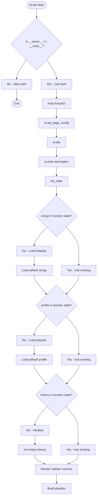
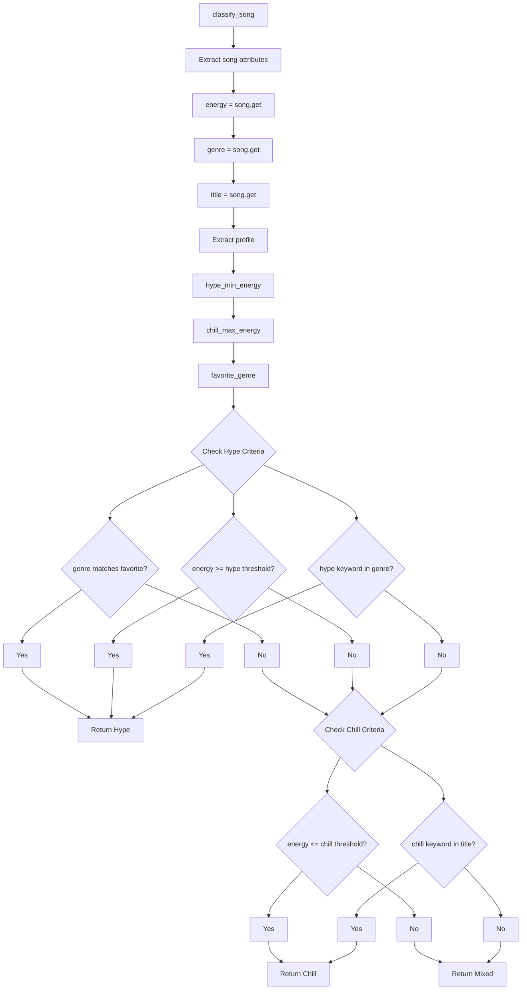
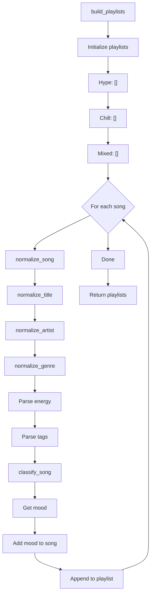
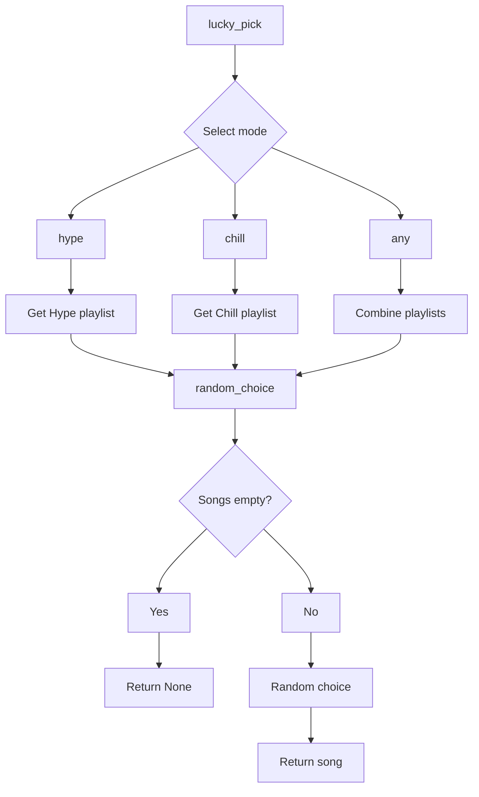
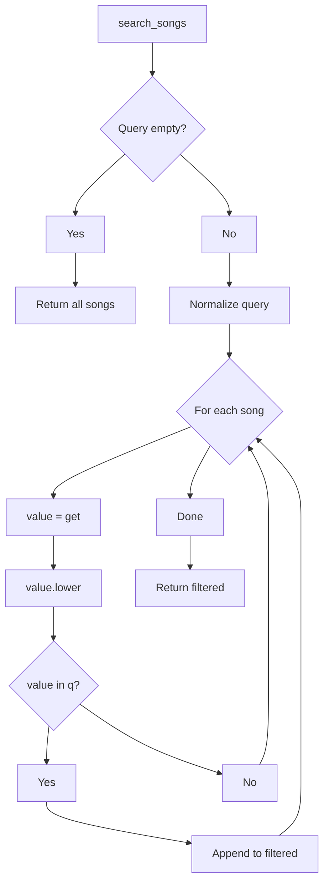
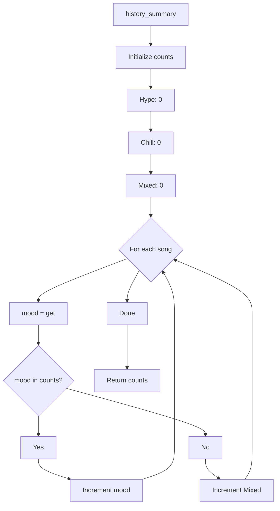
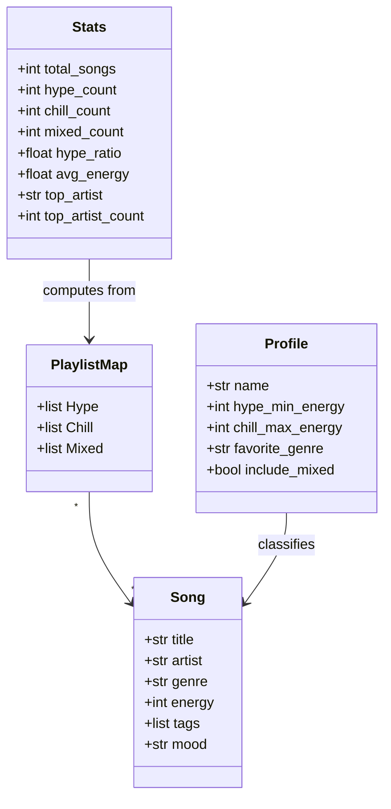

# Playlist Chaos - Logic Flow Diagram

## Overview

This diagram maps out the complete logic flow of the Playlist Chaos application, including both the Streamlit web interface ([`app.py`](app.py:1)) and the core playlist logic module ([`playlist_logic.py`](playlist_logic.py:1)).

```mermaid
flowchart TB
    subgraph APP["app.py - Streamlit Application"]
        MAIN["main()"]
        INIT["init_state()"]
        DEFAULT_SONGS["default_songs()"]
        PROFILE_SIDEBAR["profile_sidebar()"]
        ADD_SONG_SIDEBAR["add_song_sidebar()"]
        CLEAR_CONTROLS["clear_controls()"]
        PLAYLIST_TABS["playlist_tabs()"]
        RENDER_PLAYLIST["render_playlist()"]
        LUCKY_SECTION["lucky_section()"]
        STATS_SECTION["stats_section()"]
        HISTORY_SECTION["history_section()"]
    end

    subgraph LOGIC["playlist_logic.py - Core Logic Module"]
        NORMALIZE_TITLE["normalize_title()"]
        NORMALIZE_ARTIST["normalize_artist()"]
        NORMALIZE_GENRE["normalize_genre()"]
        NORMALIZE_SONG["normalize_song()"]
        CLASSIFY_SONG["classify_song()"]
        BUILD_PLAYLISTS["build_playlists()"]
        MERGE_PLAYLISTS["merge_playlists()"]
        COMPUTE_STATS["compute_playlist_stats()"]
        MOST_COMMON_ARTIST["most_common_artist()"]
        SEARCH_SONGS["search_songs()"]
        LUCKY_PICK["lucky_pick()"]
        RANDOM_CHOICE["random_choice_or_none()"]
        HISTORY_SUMMARY["history_summary()"]
    end

    subgraph DATA["Data Structures"]
        SONGS["songs: List[Song]"]
        PROFILE["profile: Dict"]
        HISTORY["history: List[Song]"]
        PLAYLISTS["playlists: PlaylistMap"]
        STATS["stats: Dict"]
    end

    MAIN --> INIT
    INIT --> SONGS
    INIT --> PROFILE
    INIT --> HISTORY

    MAIN --> PROFILE_SIDEBAR
    PROFILE_SIDEBAR --> PROFILE

    MAIN --> ADD_SONG_SIDEBAR
    ADD_SONG_SIDEBAR --> NORMALIZE_SONG
    NORMALIZE_SONG --> SONGS

    MAIN --> CLEAR_CONTROLS
    CLEAR_CONTROLS --> DEFAULT_SONGS
    DEFAULT_SONGS --> SONGS
    CLEAR_CONTROLS --> HISTORY

    MAIN --> BUILD_PLAYLISTS
    BUILD_PLAYLISTS --> SONGS
    BUILD_PLAYLISTS --> PROFILE
    BUILD_PLAYLISTS --> PLAYLISTS

    BUILD_PLAYLISTS --> NORMALIZE_SONG
    BUILD_PLAYLISTS --> CLASSIFY_SONG

    MAIN --> MERGE_PLAYLISTS
    MERGE_PLAYLISTS --> PLAYLISTS

    MAIN --> PLAYLIST_TABS
    PLAYLIST_TABS --> RENDER_PLAYLIST
    RENDER_PLAYLIST --> SEARCH_SONGS
    SEARCH_SONGS --> PLAYLISTS

    MAIN --> LUCKY_SECTION
    LUCKY_SECTION --> LUCKY_PICK
    LUCKY_PICK --> PLAYLISTS
    LUCKY_PICK --> RANDOM_CHOICE
    RANDOM_CHOICE --> HISTORY

    MAIN --> STATS_SECTION
    STATS_SECTION --> COMPUTE_STATS
    COMPUTE_STATS --> PLAYLISTS
    COMPUTE_STATS --> MOST_COMMON_ARTIST
    COMPUTE_STATS --> STATS

    MAIN --> HISTORY_SECTION
    HISTORY_SECTION --> HISTORY
    HISTORY_SECTION --> HISTORY_SUMMARY

    NORMALIZE_SONG --> NORMALIZE_TITLE
    NORMALIZE_SONG --> NORMALIZE_ARTIST
    NORMALIZE_SONG --> NORMALIZE_GENRE

    CLASSIFY_SONG --> SONG
    CLASSIFY_SONG --> PROFILE

    classDef app fill:#e1f5ff,stroke:#01579b,stroke-width:2px
    classDef logic fill:#fff3e0,stroke:#e65100,stroke-width:2px
    classDef data fill:#f3e5f5,stroke:#4a148c,stroke-width:2px

    class MAIN,INIT,DEFAULT_SONGS,PROFILE_SIDEBAR,ADD_SONG_SIDEBAR,CLEAR_CONTROLS,PLAYLIST_TABS,RENDER_PLAYLIST,LUCKY_SECTION,STATS_SECTION,HISTORY_SECTION app
    class NORMALIZE_TITLE,NORMALIZE_ARTIST,NORMALIZE_GENRE,NORMALIZE_SONG,CLASSIFY_SONG,BUILD_PLAYLISTS,MERGE_PLAYLISTS,COMPUTE_STATS,MOST_COMMON_ARTIST,SEARCH_SONGS,LUCKY_PICK,RANDOM_CHOICE,HISTORY_SUMMARY logic
    class SONGS,PROFILE,HISTORY,PLAYLISTS,STATS data
```

## Detailed Logic Flow

### 1. Application Initialization

### 2. Song Classification Logic

### 3. Playlist Building Process

### 4. Lucky Pick Feature

### 5. Statistics Computation

```mermaid
flowchart TB
    COMPUTE["compute_playlist_stats"] --> COLLECT
    COLLECT[Collect all songs] --> EXTEND
    EXTEND[Extend all_songs] --> EXTRACT_PLAYLISTS

    EXTRACT_PLAYLISTS[Extract playlists] --> HYPE
    HYPE[hype = get] --> CHILL
    CHILL[chill = get] --> MIXED
    MIXED[mixed = get] --> CALC_RATIO

    CALC_RATIO[Calculate ratio] --> RATIO
    RATIO[Divide hype by hype] --> CALC_AVG

    CALC_AVG[Calculate avg_energy] --> SUM_ENERGY
    SUM_ENERGY[Sum Hype energy] --> DIVIDE
    DIVIDE[Divide by total] --> FIND_TOP

    FIND_TOP[most_common_artist] --> COUNT_ARTISTS
    COUNT_ARTISTS[Count artists] --> SORT
    SORT[Sort by count] --> RETURN_TOP
    RETURN_TOP[Return top artist] --> RETURN_STATS

    RETURN_STATS[Return stats] --> TOTAL
    TOTAL["total_songs"] --> HYPE_COUNT
    HYPE_COUNT["hype_count"] --> CHILL_COUNT
    CHILL_COUNT["chill_count"] --> MIXED_COUNT
    MIXED_COUNT["mixed_count"] --> HYPE_RATIO
    HYPE_RATIO["hype_ratio"] --> AVG_ENERGY
    AVG_ENERGY["avg_energy"] --> TOP_ARTIST
    TOP_ARTIST["top_artist"] --> TOP_COUNT
    TOP_COUNT["top_artist_count"]
```

### 6. Search Functionality

### 7. History Summary

## Data Flow Summary

### Song Data Structure

## Key Relationships

1. **Normalization Pipeline**: [`normalize_song()`](playlist_logic.py:123) → [`normalize_title()`](playlist_logic.py:36), [`normalize_artist()`](playlist_logic.py:65), [`normalize_genre()`](playlist_logic.py:97)
2. **Classification**: [`classify_song()`](playlist_logic.py:176) uses profile to determine mood
3. **Playlist Building**: [`build_playlists()`](playlist_logic.py:257) normalizes and classifies each song
4. **UI Integration**: [`app.py`](app.py:1) functions call [`playlist_logic.py`](playlist_logic.py:1) functions
5. **State Management**: Streamlit session state holds songs, profile, and history
